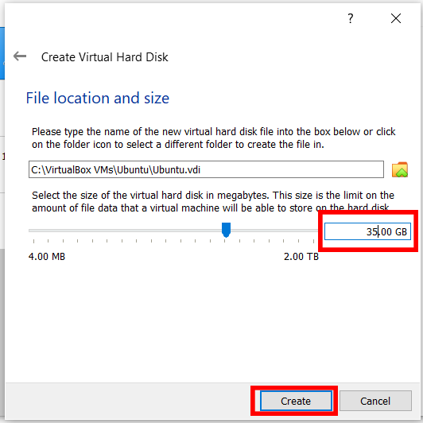

# Installing ROS Noetic on Ubuntu 20.04 using VirtualBox (on Windows)

This guide will aid you in setting up Ubuntu on a virtual machine (on a Windows PC/Laptop) and install ROS on it. While installing ROS on a virtual machine is suitable for teaching and learning purposes, however, it is recommended to dual boot your computer for development.

- Ubuntu Version: 20.04 LTS Focal Fossa

- ROS Version: ROS Noetic

Guide compiled by Ian ([@iangohy](https://github.com/iangohy)).

## Prerequisites

- PC/Laptop running Windows
- At least 35GB of free disk space

## Steps

1. [Install VirtualBox](#1-Installing-Virtualbox)
2. [Download Ubuntu ISO](#2-Download-Ubuntu-ISO)
3. [Create Virtual Machine](#3-Create-Virtual-Machine)
4. [Install Ubuntu](#4-Install-Ubuntu)
5. [Installing ROS on Ubuntu](#5-Installing-ROS-on-Ubuntu)
6. [Install VirtualBox Guest Additions (Optional)](#6-install-virtualbox-guest-additions-optional)

## 1. Installing VirtualBox

1. Download VirtualBox for **Windows Host** [here](https://www.virtualbox.org/wiki/Downloads) (Version number might be different).

   

2. Run the .exe file and install VirtualBox.

## 2. Download Ubuntu ISO

1. Download Ubuntu ISO [here](https://ubuntu.com/download/desktop).

   

   > Download may take a while as the file size for Ubuntu 20.04.2.0 LTS is 2.7GB.

## 3. Create Virtual Machine

1. Open VirtualBox.

2. Create a new virtual machine by clicking on the `New` icon or going to `Machine > New`.

   
   
3. Enter `Ubuntu` as the name. Type and Version should be automatically filled for you, if not, set Type to `Linux` and Version to `Ubuntu (64-bit)`. Click `Next`.

   

4. Increase the memory size to `6144MB` (6GB). If `6144MB` is within the orange or red zone, use a memory size of `4096MB` instead. Click `Next`.

   

5. Select `Create a virtual hard disk now` and click `Create`.

   

6. Select `VDI (VirtualBox Disk Image)` and click `Next`.

   

   1. Select `Dynamically allocated` and click `Next`.

   

7. Change the hard disk size to `35.00GB`. You may change the location where the disk image is saved at but it is alright to leave it as the default. Click `Create`.

   

8. Right-click on the newly created virtual machine and click `Settings`. Alternatively single left-click the virtual machine and go to `Machine > Settings`. 

   

9. Navigate to `Storage` on the left-hand menu and select the `Storage` tab. Click on the line with the CD. On the right, under `Optical Drive`, click on the CD icon with the down arrow and select `Choose a disk file...`. Navigate to the earlier downloaded Ubuntu ISO.

  

10. Navigate to `System` on the left-hand menu and select the `Processor` tab. Increase the slider until the end of the green zone, which may be different as compared to the diagram below.

    

## 4. Install Ubuntu

1. Double click on the newly created virtual machine.

   

   > The virtual machine will start to boot

2. Wait while the virtual machine to checks the disk.

   

3. Select `Install Ubuntu`.

   

4. Choose your keyboard layout as `English (US)`. Click `Continue`.

   

5. Select `Minimal installation`, `Download updates while installing Ubuntu` and `Install third-party software for graphics and Wi-Fi hardware and additional media formats`. Click `Continue`.

   

6. Select `Erase disk and install Ubuntu`. Click `Install Now `and click `Continue` if a warning pops out.

   

7. Select your country and click `Continue`.

8. Enter your personal details and click `Continue`.

9. Wait while Ubuntu installs. This may take a while.

10. Restart the VM. If prompted to remove the installation medium, just press enter.

    

11. Congratulations! You've successfully installed Ubuntu on a virtual machine.

## 5. Installing ROS on Ubuntu

1. Follow the instructions found [here](http://wiki.ros.org/noetic/Installation/Ubuntu). For convenience, the commands have been listed below. If you encounter any errors or want to find out more, please go to the link to follow the full guide. Alternatively,

2. Open `Software & Updates` program by pressing the windows key and searching `Software & Updates`.

3. Tick all boxes and click `Close`.

   

4. Click `Reload`.

5. Open a terminal window by pressing the windows key and searching `Terminal` or using the keyboard shortcut `Ctrl+Alt+T`.

6. Run the following commands sequentially. For convenience, you may want to install the [virtualbox guest additions](#6-install-virtualbox-guest-additions-optional) which will enable `Host to Guest` clipboard via `Devices > Shared Clipboard > Host to Guest `, allowing you to copy from Windows and paste in Ubuntu. Alternatively, you can navigate to this page on Firefox in the virtual machine to copy and paste the commands.

    > Commands adapted from http://wiki.ros.org/noetic/Installation/Ubuntu.

    Set up sources.list
    
    ```
    sudo sh -c 'echo "deb http://packages.ros.org/ros/ubuntu $(lsb_release -sc) main" > /etc/apt/sources.list.d/ros-latest.list'
    ```
    
    Set up keys
    ```
    sudo apt-key adv --keyserver 'hkp://keyserver.ubuntu.com:80' --recv-key C1CF6E31E6BADE8868B172B4F42ED6FBAB17C654
    ```
    
    Update Debian package index
    ```
    sudo apt update
    ```
    
    Install ROS Desktop-Full
    ```
    sudo apt install -y ros-noetic-desktop-full
    ```
    
    Source setup.bash
    ```
    echo "source /opt/ros/noetic/setup.bash" >> ~/.bashrc
    source ~/.bashrc
    ```
    
    Install dependencies for building packages
    ```
    sudo apt install -y python3-rosdep python3-rosinstall python3-rosinstall-generator python3-wstool build-essential
    ```
    ```
    sudo rosdep init
    rosdep update
    ```
    
    Create a ROS Workspace
    ```
    mkdir -p ~/catkin_ws/src
    cd ~/catkin_ws/
    catkin_make
    ```
    
    Source catkin workspace
    ```
    echo "source $(pwd)/devel/setup.bash" >> ~/.bashrc
    source ~/.bashrc
    ```

## 6. Install VirtualBox Guest Additions (Optional)

VirtualBox Guest Addition on the guest OS will allow you to resize the window of VirtualBox.

1. Open a terminal window and run

   ```
   sudo apt-get install -y build-essential gcc make perl dkms && sudo reboot now
   ```

2. After the virtual machine has rebooted, login and click on `Devices > Insert Guest Additions CD image...

   

3. Run the Guest Additions CD image

   
